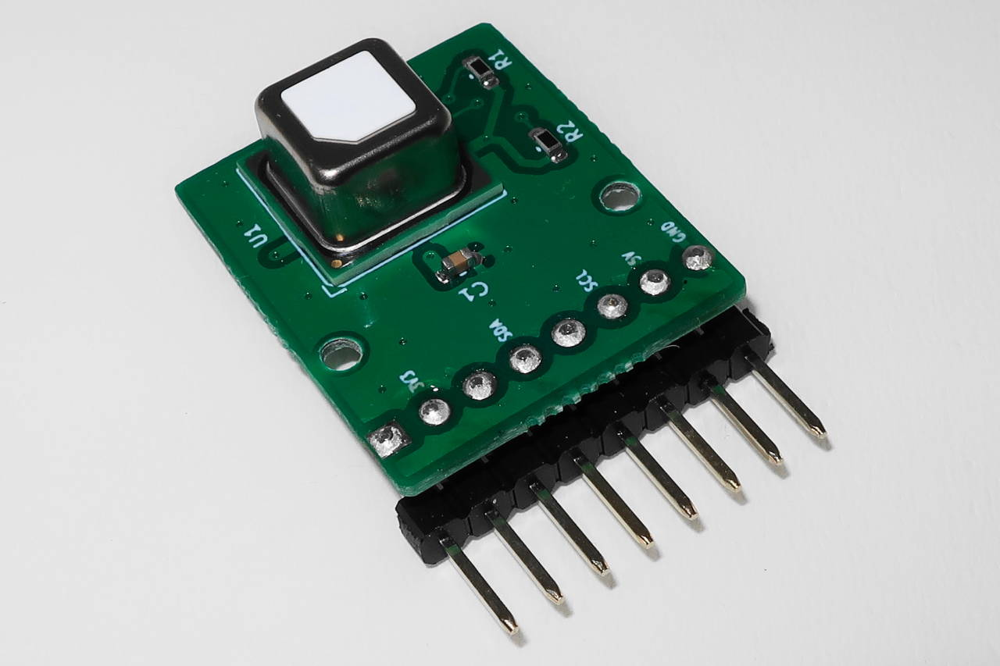

# M5StickC Proto Hat向けCO2センサボード サンプルプログラム

## 概要
  

  
  

  * M5Stack製 [M5StickC Proto Hat][1] にぴったり収まる、Sensirion製の小型な [CO2センサSCD40][2](温度・湿度センサも内蔵) を搭載した小型のブレイクアウトボードです。
  * はんだ付け不要で、M5StickC Proto Hatの基板と置き換えるだけで使用できます。
  * M5StickC Proto Hatを使用せず、ブレッドボードなどでも使用が可能です。
  * [M5StickC][3] / [M5StickC Plus][4] の他、[CoreInk][5] と組み合わせた場合、低消費電力により内蔵バッテリーのみで約2週間(更新間隔10分の場合)の使用が可能です。

  製品のサポートや、M5StickC Proto Hat の基板入替手順などについては、[M5StickC Proto Hat向けCO2センサボード サポートページ][6] を参照ください。

## サンプルプログラム
  以下 M5Stack 製品向けのサンプルプログラムを用意しています。サンプルプログラムはネットワークに接続せず、センサから読みだした値を表示するのみのオフラインモードと、IoTデータの可視化サービス [Ambient][7] へのデータアップロードに対応したオンラインモードに対応しています。  
  どちらのモードも、画面にはCO2濃度(ppm)/温度(℃)/相対湿度(%)/バッテリー残量(%)が表示されます。  
  サンプルプログラムの書き込みについては Arduino IDE 1.8.16 での動作を確認しています。

  M5Stack 製品での Arduino IDE 環境のセットアップについては、公式のクイックスタートガイドを参照ください。
  * [M5StickC][13]
  * [M5StickC Plus][14]
  * [M5-CoreInk][15]

  | M5Stack 製品名 ↓ 対応プログラム名 | 特徴・注意事項 |
| ---- | ---- |
| M5StickC/M5StickC Plus ↓ scd4x-board-m5stickc | デフォルトの更新間隔は1分で、CO2濃度/温度/相対湿度の値に応じて注意レベルを3段階(緑/オレンジ/赤)で表示します、注意レベルの閾値は必要に応じて修正が可能です。 ※プログラム書き込み後はUSBケーブルを抜き電源を入れなおしてください ※内蔵バッテリーのみの場合数時間程度しか持たないため、USBバスパワーでの使用をおすすめします |
| CoreInk ↓ scd4x-board-coreink | デフォルトの更新間隔は10分で、内蔵バッテリーのみでオフラインモードで約2週間、オンラインモードで約1週間動作することを確認しています。 ※プログラム書き込みまたは充電後はUSBケーブルを抜き、背面のリセットボタンを押してください ※内蔵バッテリーのみでの動作を前提としていますので、USBバスパワー時はセンサ値は更新(データアップロード含め)されません ※WiFi接続状態が悪い環境で接続に時間がかかる場合、バッテリーの持ちが短くなります |

  サンプルプログラムは、以下ライブラリを使用していますので、ZIPファイルをダウンロード後、 Arduino IDE のライブラリとしてインクルードを行って下さい。  
  Arduino IDE: スケッチ -> ライブラリをインクルード -> .ZIP形式のライブラリをインストール

  * [Sensirion I2C SCD4x Arduino Library][8]
  * [Sensirion Arduino Core Library][9]

  M5StickC/M5StickC Plus/CoreInk のライブラリを以下の手順で追加します。  
  Arduino IDE: スケッチ -> ライブラリを管理 の検索で M5Stack を入力して、該当のライブラリをインストールします。

  また、Ambientへのデータ送信を有効にした場合、[Ambientライブラリーのインストール][10] を参考に、ライブラリのインストールを行ってください。

  ### CO2出力値のキャリブレーション(校正)について
  工場出荷状態では自動自己校正(ASC)アルゴリズムが設定されているため、少なくとも週に1回外気または同等の環境(窓際など)に置くことで、最小値を400ppmとして自動校正されます。

  また、ASC は時間がかかるため、すぐに校正が必要な場合は以下の手順で校正を行ってください。
  
  M5StickC/M5StickC Plus の場合、Aボタンを押したまま電源をオン。 
  CoreInk の場合、多機能ボタンを押し込んだまま電源をオン。 
  起動後、"Performing FRC(5 min.)" と表示され、5分経過した時点を基準にCO2出力値を400ppmとして校正されます。

  ASC オン/オフの設定は、M5StickC/M5StickC Plus の場合、Bボタンを押したまま電源をオン、CoreInk の場合、多機能ボタンを上方向に押したまま電源をオンにすることで切り替えが可能です。 
  設定状態は、画面の一番右下に ASC がオンの場合は ASC と表示され、オフの場合は表示なしとなります。 
  ASC オン/オフ設定に対応したプログラムかどうかの確認は、ボードを接続しない状態で起動し、画面の一番右下の ASC 表示有無で確認が可能です。

  ### プログラムの各種設定について
  基本の設定は以下の通り。  
  | #define | 説明 |
| ---- | ---- |
| M5STICKC_PULS_EN | M5StickC/M5StickC Plus用の定義、M5StickC Plus を使用する場合に有効にしてください。 |
| UPLOAD_DATA_EN | オンラインモード(Ambient)で使用する場合に有効にして、WIFI_SSID、WIFI_PASS、AMB_CH_ID、AMB_WR_KEY の値を指定してください。 |
| ALERT_LED_BUZZER_EN | M5StickC/M5StickC Plus用の定義、CO2濃度/温度/湿度がアラートレベル2の最大値(定数ALERT_LV2_*_MAXで指定可能)以上でLEDを点灯させる場合に有効にしてください。 M5StickC Plus はブザーも有効になりますが、音量はかなり小さいです。 |
| ALERT_BUZZER_EN | CoreInk用の定義、CO2濃度/温度/湿度がアラートレベル2の最大値(定数ALERT_LV2_*_MAXで指定可能)以上でLEDを点灯させる場合に有効にしてください。 |
  
  ネットワーク、他の設定は以下の通り。
  | 定数名 | 説明 |
| ---- | ---- |
| WIFI_SSID | WiFiのSSID文字列、******** を置き換えてください。 |
| WIFI_PASS | WiFiのパスワード文字列、******** を置き換えてください。 |
| AMB_CH_ID | Ambient のチャネルID(数値)、0 を使用する ID に置き換えてください。 |
| AMB_WR_KEY | Ambient のチャネルID(16桁の文字列)、**************** を置き換えてください。 |
| UPDATE_INTERVAL_S | センサーからのデータ読み出し間隔(秒) デフォルト値 M5StickC/M5StickC Plus:60 CoreInk:600、範囲 30-3600 |
| LCD_BRIGHTNESS_LV | M5StickC/M5StickC Plus 用の定義、LCDの明るさ デフォルト値 10、範囲 7-12 |
| ALERT_LV1_*_MIN | CO2濃度(CO2)/温度(TEMP)/湿度(HUMI)のアラートレベル1の最小値 |
| ALERT_LV1_*_MAX | CO2濃度(CO2)/温度(TEMP)/湿度(HUMI)のアラートレベル1の最大値 |
| ALERT_LV2_*_MIN | CO2濃度(CO2)/温度(TEMP)/湿度(HUMI)のアラートレベル2の最小値 |
| ALERT_LV2_*_MAX | CO2濃度(CO2)/温度(TEMP)/湿度(HUMI)のアラートレベル2の最大値 |
| ALERT_BUZZER_REPEAT_NUM | M5StickC Plus/CoreInk 用の定義、CO2濃度/温度/湿度がアラートレベル2の時のブザー鳴動回数 デフォルト値 3、範囲 1-10 |

  CO2濃度/温度/相対湿度のアラートレベルの初期値は以下の通りです。必要に応じて修正してください。
  | 項目 | LV1(快適) | LV2(注意) | LV3(要注意) LED・ブザーの対象 |
| ---- | ---- | ---- | ---- |
| CO2濃度 | 1000ppm未満 | 1000ppm以上 2000ppm未満 | 2000ppm以上 |
| 温度 | 22℃以上 26℃未満 | 16℃以上 22℃未満、 または 26℃以上 30度未満 | 16℃未満、 または 30℃以上 |
| 相対湿度 | 40%以上 50%未満 | 20%以上 40%未満、 または 50%以上 65%未満 | 20%未満、 または 65%以上 |

## 注意事項
  * 医療用途や工業用途、厳密な測定が必要な用途には使用しないでください。
  * CO2の出力値は、工場出荷状態では自動自己校正(ASC)アルゴリズムが設定されているため、少なくとも週に1回外気または同等の環境(窓際など)に置くことで、最小値を400ppmとして自動校正されます、また CO2基準値を使用しての強制再校正(FRC)も可能です。

## お問い合わせ先
  製品に関するご不明点やご質問につきましては、[こちら][11] からお問い合わせください。

## 資料
  * [SCD4x製品ページ][12]

[1]: https://www.switch-science.com/catalog/6066/
[2]: https://www.sensirion.com/jp/environmental-sensors/carbon-dioxide-sensors/carbon-dioxide-sensor-scd4x/
[3]: https://www.switch-science.com/catalog/5517/
[4]: https://www.switch-science.com/catalog/6470/
[5]: https://www.switch-science.com/catalog/6735/
[6]: https://mktechlab.net/co2-sensor-board-scd4x/
[7]: https://ambidata.io/
[8]: https://github.com/Sensirion/arduino-i2c-scd4x
[9]: https://github.com/Sensirion/arduino-core
[10]: https://ambidata.io/docs/esp8266/#library_import
[11]: https://mktechlab.net/about/
[12]: https://www.sensirion.com/jp/environmental-sensors/carbon-dioxide-sensors/carbon-dioxide-sensor-scd4x/
[13]: https://docs.m5stack.com/en/quick_start/m5stickc/arduino
[14]: https://docs.m5stack.com/en/quick_start/m5stickc_plus/arduino
[15]: https://docs.m5stack.com/en/quick_start/coreink/arduino
